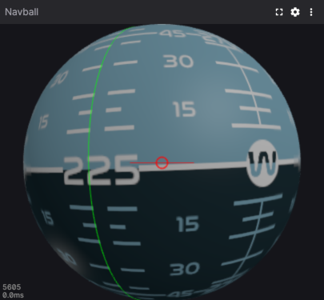

# Foxglove Navball

This is an attitude indicator extension for [Foxglove](https://foxglove.dev).
You can subscribe it to a
[Quaternion](https://docs.foxglove.dev/docs/visualization/message-schemas/quaternion)
topic.
You can optionally subscribe it to a
[Vector3](https://docs.foxglove.dev/docs/visualization/message-schemas/vector-3)
topic to describe a course heading, which will be represented as a green
meridian on the sphere.



## Installation

With node and foxglove installed:

```console
$ npm install
$ npm run local-install
```
